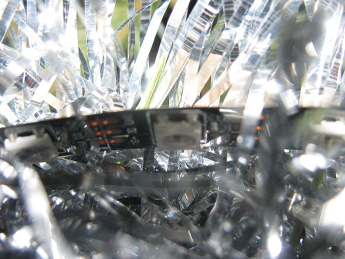
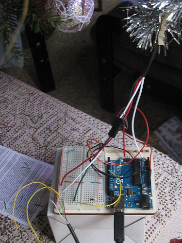

# Christmas tree blinkenlights 2013

See my [Youtube video] for what this does.

Provided under the [GPLv3] license.

# Parts

* 4m 60LED/m WS2812 strip. You can get the [Adafruit Neopixel strip],
  if you order 4 they'll come as a single 4m piece
* 8m of shiny silver-colored non-conductive tinsel
* some white thread
* Breadboard and a couple of connecting wires
* USB charger (5V/~4A) and a throwaway cable (or another 5V power source)
* Arduino Uno (with USB cable, and a computer or *extra* USB charger)
* A tree

# Physical installation

Place the LED strip between two strands of tinsel, so that the LEDs are hidden,
and tie with pieces of thread about 10cm apart.
The shiny tinsel will reflect and disperse the light.
Carefully hang the strip on the tree.

# Wiring

Circuit-wise this'll be one of your easier projects:

                           WS2812 strip
                            +  -  DATA
                            │  │   │
                +5V─────────┘  │   └──Pin 7
    USB charger                │           Arduino (powered separately)
                GND────────────┴───────GND

Cut the USB cable and stick the +5V and GND wires in the breadboard.
(Tinning the ends a bit with a soldering iron might make it easier).
Connect + of LED strip to +5V from the cut cable, and - of the strip to ground.
Connect ground of USB cable to the ground pin of the Arduino.
Connect Arduino pin 7 to the Data wire of the LED strip.
Connect the Arduino to the computer via a good USB cable.

A photo of my setup (though there some extra elements in it from
earlier/parallel projects):

# Programming

Install the [NeoPixel library] and load the sketch to the Arduino tool
(or just use [ino] on the command line).
Build and load the program and watch it blink!
Once loaded, you can disconnect the Arduino from the computer and power it from
another USB charger.

Powering the LED strip and Arduino separately ensures that if the LEDs
overload their power supply, he control logic won't be affected.
The LEDs are quite power-hungry so overloads are not rare.
If one of your chargers can provide more current, use that one for the LEDs.

Have fun!

[Youtube video]: http://www.youtube.com/watch?v=JaaDgWfSxLg
[GPLv3]: http://www.gnu.org/licenses/gpl-3.0.html
[NeoPixel library]: https://github.com/adafruit/Adafruit_NeoPixel
[Adafruit Neopixel strip]: http://www.adafruit.com/products/1138
[ino]: http://inotool.org/
